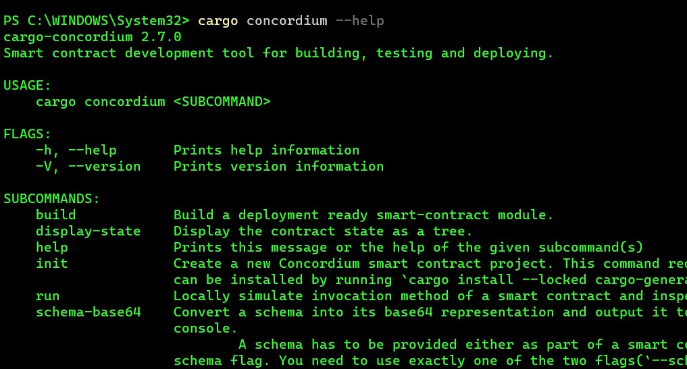
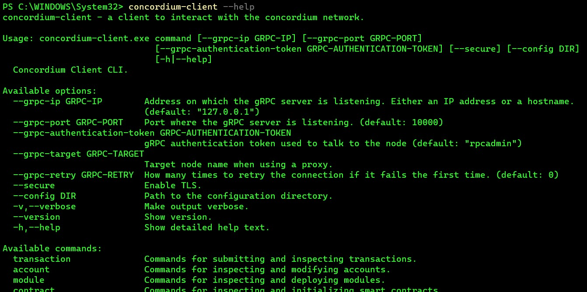
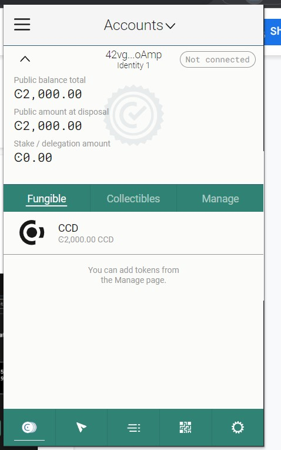

# Concordium

# TASk-1:

## Install Rust and Cargo

Download the rustup-init file and install.

Download cargo-concordium tool and copy it to the Cargo's bin directory.

## concordium-client:

# Wallet

Once everything is setup. Download the concordium wallet extension for Google Chrome and create an account for test. Export the private key and import it.

